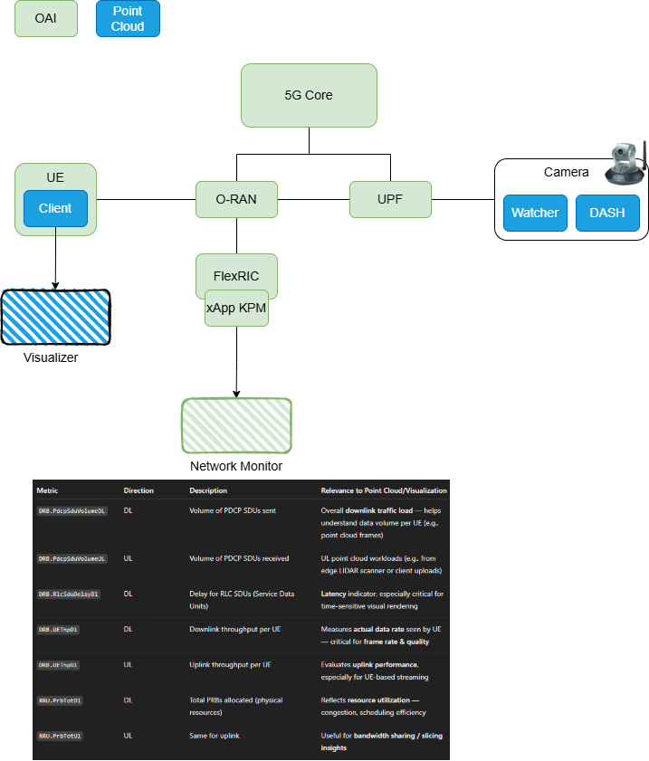
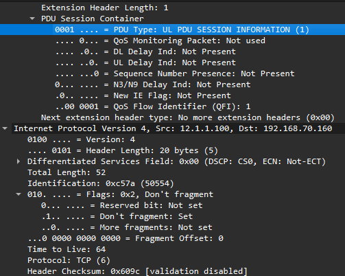

# A testbed for O-RAN Research and Implementation

## This README contains instructions to run OAI-5G Core, OAI-O-RAN, UERANSIM, OAI-FlexRIC

## Deploy OAI-5G Core
```
# Should use kubens to change namespace
kubens oai

cd ~/oai-v210/charts/oai-5g-core/oai-5g-basic
helm dependency update

helm install oai-5g-basic . -n oai
```

## Deploy OAI-O-RAN
```
cd ~/oai-v210/charts/oai-5g-ran/oai-cu-cp
helm install oai-cu-cp .

helm install oai-cu-up ../oai-cu-up 
helm install oai-du ../oai-du
helm install oai-nr-ue ../oai-nr-ue

export UEPOD=$(kubectl get pods -l app.kubernetes.io/name=oai-nr-ue -o jsonpath="{.items[*].metadata.name}" -n oai)
kubectl exec -it $UEPOD -- bash

#ping towards spgwu/upf
ping -c 3 -I oaitun_ue1 12.1.1.1

#ping towards google dns
ping -c 3 -I oaitun_ue1 8.8.8.8
```

## Or use scripts to deploy OAI
```
kubens oai
cd ~/oai-v210

# before running the below command, this scenario does not include RIC,
# so change images from CUCP/CUUP/DU values.yaml to not use ddocker122/oai-e2gnb-mono:dev
chmod +x deploy_oai.sh
bash deploy_oai.sh . core cu ue
```

# ----------------------------------
# To use UERANSIM instead
## Cloud
```
helm repo add towards5gs 'https://raw.githubusercontent.com/Orange-OpenSource/towards5gs-helm/main/repo/'
helm repo update
helm search repo

cd ~/oai-v210/towards5gs-helm/charts/ueransim
helm dependency update
helm install ueransim .
```

## Baremetal
### Build UERANSIM
```
cd UERANSIM/

sudo apt update && sudo apt upgrade -y

sudo apt install make gcc g++ libsctp-dev lksctp-tools iproute2 -y
sudo snap install cmake --classic
```

### Run RAN
```
sudo apt install net-tools -y
python3 config_UERAN.py
./build/nr-gnb -c ./build/OAI-gnb.yaml

sudo ./build/nr-ue -c ./build/OAI-ue.yaml -i imsi-001010000000101
sudo ./build/nr-ue -c ./build/OAI-ue.yaml -i imsi-001010000000102

ping -c 3 -I uesimtun0 google.com
ping -c 3 -I uesimtun1 google.com

curl -I --interface uesimtun0 google.com
```
# ----------------------------------

## Uninstall all deployments
```
Ctrl + C in terminals running UERANSIM to stop processes
helm uninstall $(helm list -aq -n oai) -n oai
```

## Debugging
```
# sample to run tcpdump, curl, etc. in upf (same for others) pod when tcpdump, curl, etc. is not available in the pod
# --target is name of container in pod

export PODNAME=$(kubectl get pods -l app.kubernetes.io/name=oai-upf -o jsonpath="{.items[*].metadata.name}" -n oai)
kubectl debug -it $PODNAME --image=nicolaka/netshoot --target=upf -- bash

# check helm charts render
helm template ueransim ./dir/to/charts -f values.yaml > rendered.yaml

# check multus network attachments
kubectl get network-attachment-definition
```

# Roadmap
# 1. AF implementation
* AF influence traffic for dynamic traffic steering 🧠🚧
# 2. OAI-RIC integration
* rApp & xApp for Traffic steering use case ❌
* Use cases:
    - Point Cloud tramission ✅
    - Custom xApp

## FlexRIC
### Using Helm
```
cd helm-flexric/
bash deploy_flexric.sh
```
### Baremetal (read more on https://gitlab.eurecom.fr/mosaic5g/flexric/-/tree/dev?ref_type=heads)
```
sudo apt update -y
sudo apt upgrade -y
sudo apt install -y build-essential
sudo apt install -y gcc-13 g++-13 cpp-13
sudo update-alternatives --install /usr/bin/gcc gcc /usr/bin/gcc-13 100 --slave /usr/bin/g++ g++ /usr/bin/g++-13 --slave /usr/bin/gcov gcov /usr/bin/gcov-13
sudo update-alternatives --config gcc # chose gcc-13

sudo apt install libsctp-dev cmake-curses-gui libpcre2-dev

sudo apt install -y automake bison

git clone --branch release-4.1 --single-branch https://github.com/swig/swig.git
cd swig
./autogen.sh
./configure --prefix=/usr/
make -j8
sudo make install

# ...follow instructions on mosaic5g/Flexric repo

```

## Flexric + OAI O-RAN
```
chmod +x deploy_oai.sh
# the below command is to run 5g Core, nearRT-RIC, gNB, NR-UE, xApp kpm
bash deploy_oai.sh . core ric gnb ue-gnb kpm

# the below command is to run 5g Core, nearRT-RIC, CU/DU, NR-UE, xApp kpm
# make sure to use image ddocker122/oai-e2gnb-mono:dev for CUCP/CUUP/DU
bash deploy_oai.sh . core ric cu ue-gnb kpm

# use docker compose, by default, it runs 5g Core, nearRT-RIC, CU/DU, NR-UE, xApp kpm, xApp gtp-mac-rlc-pdcp, xApp rc
cd docker-compose
docker compose -f docker-compose-oai-v210.yaml up -d
docker compose -f docker-compose-oai-v210.yaml down
```

## Point cloud transmision with OAI - Use case 1: UE is client (e.g., admin)
<p align="center">
  
</p>
### Clone Pointcloud project & build dependencies
Draco compression
```
git clone https://github.com/binhfdv/pcl_handson.git
cd pcl_handson/
sudo apt update && sudo apt install -y wget unzip cmake make g++
git clone https://github.com/google/draco.git && cd draco
mkdir build && cd build
cmake ..
make
```

Visualizer
```
sudo apt update && sudo apt install -y libpcl-dev
cd pcl_handson/pcl_viewer
mkdir build && cd build
cmake .. -DCMAKE_C_COMPILER=gcc -DCMAKE_CXX_COMPILER=g++
make
```

Comment line `set(CMAKE_CXX_COMPILER g++-9)` in the `/pcl_viewer/CMakeLists.txt`.

In OAI, we normally use `g++ 12` or `g++ 13` so to prevent built error we force it to use our current `g++` version.

### Terminal 1. Deploy OAI, RIC, PointCloud Server
```
cd docker-compose/
docker compose -f docker-compose-oai-v210-pointcloud-usecase-1.yaml up -d
```

This runs 5GC, split CU/DU, UE and Point cloud services.

### Terminal 2. Run Client on UE
```
docker exec -it oai-ue /bin/bash
export PATH=$PATH:/draco/build
cd /client/
python3 oai_main.py
```

### Terminal 3. Relay data generation
```
cd pcl_handson/
sudo bash replay_ply.sh ./sample_ply/ ./media/ply_input/ 1
```

### Terminal 4. Visualize data
```
export DISPLAY=:0
export PATH=$PATH:./pcl_handson/pcl_viewer/build
pcl_viewer ./pcl_handson/PointClient/pythonProject/downloads/
```

**This is not tested in the demo yet due to the purpose of testing data connection between nr-UE to Pointcloud server for data transmission.**

You can try your own visualizer with the datatype is `ply` in folder `./pcl_handson/PointClient/pythonProject/downloads/`. You can also try the visualizer in repo [pcl_handson](https://github.com/binhfdv/pcl_handson).

The display is set up as `export DISPLAY=:0`. Depending on your OS.

Should we run on a Ubuntu server, follow the instructions in repo [pcl_handson](https://github.com/binhfdv/pcl_handson).

Check display by typing `xeyes`.

Change graphics type to x11 if needed `sudo nano /etc/gdm3/custom.conf`, uncomment `WaylandEnable=false`.

### Successful data transmisstion
- 1. Ply data is downloaded to `./pcl_handson/PointClient/pythonProject/downloads/`
- 2. Traffic trace from UE to Pointcloud Server:
 <p align="center">
  
</p>

### Clean up
```
docker compose -f docker-compose-oai-v210-pointcloud-usecase-1.yaml down
```