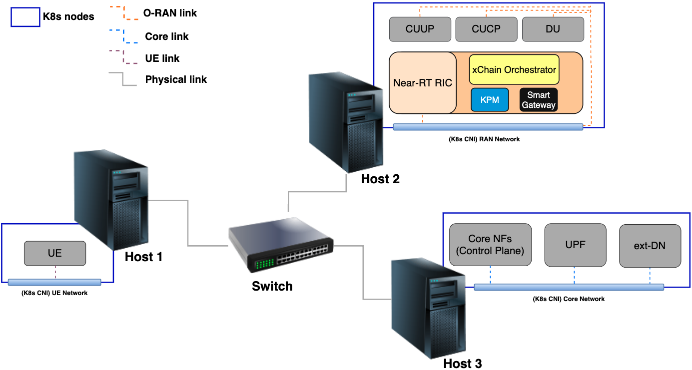

# Testbed Documentation

## 1. Overview
This document describes the hardware and software configuration of the testbed environment for experimentation with **Kubernetes**, **OAI 5G**, and **O-RAN**.  

The testbed consists of multiple Ubuntu servers, an Aruba switch, and a Kubernetes cluster.

  

---

## 2. Hardware Information

### 2.1 Ubuntu 22 – *ue*
- **System**: NUC7i7BNHX  
- **Motherboard**: NUC7i7BNB  
- **CPU**: Intel(R) Core(TM) i7-7567U CPU @ 3.50GHz  
- **Memory**: 16GiB SODIMM DDR4 2133 MHz  
- **Storage**: 500GB Samsung SSD 860
- **Graphics**: Iris Plus Graphics 650  
- **Networking**:  
  - Wireless: 8265 / 8275  
  - Ethernet: I219-V Gigabit  

---

### 2.2 Ubuntu 20 – *gnb & ric*
- **System**: H170N-WIFI  
- **CPU**: Intel(R) Core(TM) i7-6700 CPU @ 3.40GHz  
- **Memory**: 32GiB DDR4 2133 MHz (2 × 16GiB DIMMs)  
- **Storage**: 500GB Samsung SSD 850  
- **Graphics**: Intel HD Graphics 530  
- **Networking**:  
  - Wired: I211 Gigabit Ethernet, I219-V  
  - Wireless: Intel 8260  

---

### 2.3 Ubuntu 20 – *core*
- **System**: H270N-WIFI  
- **CPU**: Intel(R) Core(TM) i7-6700 CPU @ 3.40GHz  
- **Memory**: 32GiB DDR4 2133 MHz (2 × 16GiB DIMMs)  
- **Storage**: 500GB Samsung SSD 850
- **Graphics**: Intel HD Graphics 530
- **Networking**:  
  - Wired: I211 Gigabit Ethernet, I219-V
  - Wireless: Intel 8265 / 8275

---

### 2.4 Networking Equipment
- **Switch**: Aruba 2930F

---

## 3. Software Information

- **Operating Systems**:  
  - Ubuntu 22 (for *ue*)  
  - Ubuntu 20 (for *gnb ric* and *core*)  

- **Kubernetes Cluster**:  
  - Kubernetes version: **1.30.5-1.1**  
  - Docker version: **28.4.0**  
  - Deployment guide: [K8s + Prometheus + Grafana setup](https://github.com/binhfdv/k8s-prometheus-grafana)
  - **The above reference is to install K8s control-plane node. If you want to install all in one machine, then just need to follow it. Otherwise, refer [Join worker nodes K8s cluster](https://medium.com/@amirhosseineidy/how-to-join-master-node-or-control-plane-to-kubernetes-cluster-e16be68459bf#:~:text=that%20is%20shown.-,Join%20worker%20node%3A,-kubeadm%20join%20%3Cmaster) to join worker nodes to the cluster.**

**Notes: only deploy Prometheus, Grafana if you want to have system monitoring and dashboad. Otherwise, K8s cluster is enough for the testbed to run.**

- **OAI 5G / O-RAN**:  
  - Reference: [OAI v2.1.0](https://github.com/binhfdv/oai-v210/?tab=readme-ov-file#flexric--oai-o-ran--tractor-on-k8s)  
  - Follow above reference to deploy what you need. For instance, `5G Core + gnb + RIC + xApps` or `5G Core + CU/DU + RIC + xApps, etc.` 
---

## 4. Testbed Topology
- Aruba 2930F switch interconnects all Ubuntu nodes.  
- Kubernetes cluster runs across the three servers (*ue*, *gnb*, *ric*, *core*).  
- OAI 5G and O-RAN components are deployed on top of the Kubernetes cluster.  

---

## 5. Notes
- Ensure BIOS settings allow virtualization.  
- Verify Docker and K8s versions match compatibility with OAI/O-RAN components.  
- Carefully verify interface configurations.cle 

---
